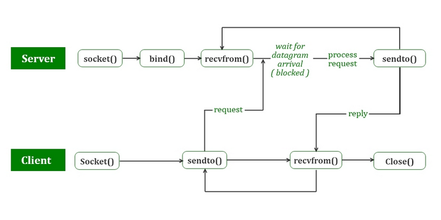
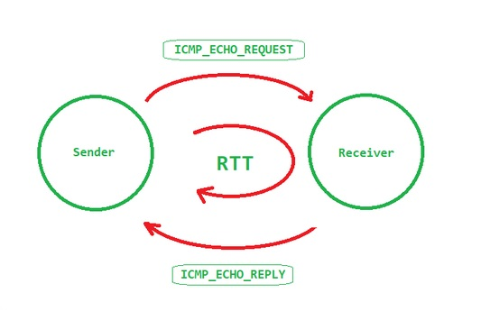
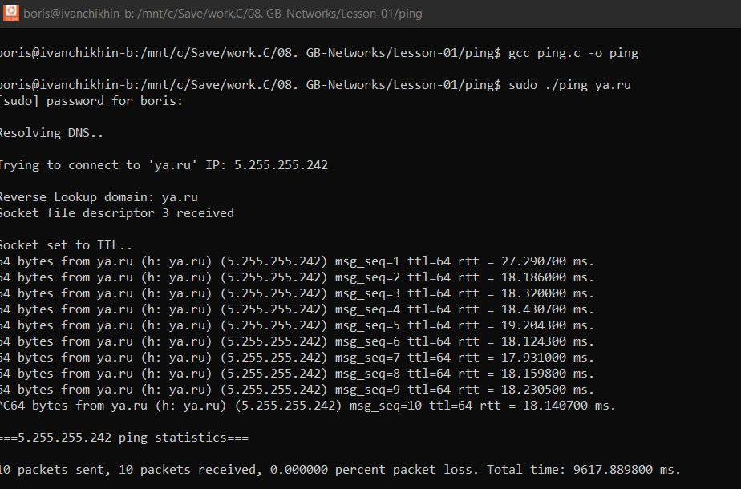

#### Course: Network programming in C++  
#### Lesson 01. Networking. Sockets and UDP.

***  

#### Задачи.  

  1. Дополнить реализованный <b>UDP-сервер</b> обратным резолвом имени клиента.  
  2. Дополнить реализованный <b>UDP-сервер</b> так образом, чтобы он принимал команду “<b>exit</b>” и при её получении завершал работу.  
  3*. Реализовать утилиту <b>Ping</b>.  
  4*. Реализовать <b>UDP-клиент</b> для работы с <b>UDP-сервером</b>.  

***  

#### Комментарии.  

-  Использован паттерн проектирования [<b>Цепочка ответственности/Chain of responsibility</b>](https://habr.com/ru/post/538954/).  

-  <b>Реализация сервера-клиента UDP на C++</b>.  
   <b>UDP клиент</b> не устанавливает соединение с сервером, как в TCP, а вместо этого отправляет дейтаграмму. Точно так же серверу не нужно принимать соединение, он просто ждет поступления дейтаграмм. Дейтаграммы по прибытии содержат адрес отправителя, который сервер использует для отправки данных правильному клиенту.  

   

   Весь процесс можно разбить на следующие этапы: 

   <b>UDP-сервер</b>:  
   * Создать UDP-сокет.  
   * Привязать сокет к адресу сервера.  
   * Подождать, пока пакет дейтаграммы прибудет от клиента.  
   * Обработать пакет дейтаграммы и отправьте ответ клиенту.  
   * Вернуться к третьему шагу.  

   <b>UDP-клиент</b>:  
   * Создать UDP-сокет.  
   * Отправить сообщение на сервер.  
   * Подождать, ответ от сервера.  
   * Обработать ответ и при необходимости вернитесь к шагу 2.  
   * Закрыть дескриптор сокета и выйти.  

   Необходимые функции:  

   ```C++

   // Создает несвязанный сокет в указанном домене.
   // Возвращает дескриптор файла сокета.
   int socket(int domain, int type, int protocol)

   // Назначает адрес несвязанному сокету.
   int bind(int sockfd, const struct sockaddr *addr, socklen_t addrlen)

   // Отправляет сообщение на сокет.
   ssize_t sendto(int sockfd, const void *buf, size_t len, int flags,
                  const struct sockaddr *dest_addr, socklen_t addrlen)

   // Получает сообщение от сокета.
   ssize_t recvfrom(int sockfd, void *buf, size_t len, int flags,
                    struct sockaddr *src_addr, socklen_t *addrlen)

   // Закрывает сокет
   int close(int fd)

   ```

-  <b>Ping в C</b>.  
   Ping отправляет пакеты ICMP, открывая RAW-сокет (отделен от TCP и UDP). Поскольку IP не имеет какого-либо встроенного механизма для отправки сообщений об ошибках и управляющих сообщений, то для этих целей применяется протокол Internet Control Message Protocol (ICMP).  
   Принцип работы программы Ping во многом похож на принцип эхо-локации гидролокатора. Ping отправляет небольшой пакет информации (содержащий ICMP ECHO_REQUEST) на указанный компьютер, который возвращает пакет ECHO_REPLY в ответ. Пакет также содержит значение параметра TTL (time-to-live). TTL определяет максимальное количество переходов маршрутизатора. Если пакет не доходит, то отправитель возвращается с сообщением об ошибке. Ошибки бывают следующих типов:  
   * Срок действия TTL истек при транспортировке;  
   * Конечный хост недоступен;  
   * Время ожидания запроса истекло, т.е. ответа нет;  
   * Неизвестный хост.  

   

   Алгоритм Ping:  
   * Получить на входе hostname.  
   * Выолнить DNS lookup.  
     Поиск DNS можно выполнить с помощью gethostbyname().  
   * Можно также реализовать reverse DNS lookup.  
     Обратный поиск в DNS выполняется с помощью getnameinfo().  
   * Открыть Raw socket используя SOCK_RAW с протоколом IPPROTO_ICMP.  
     Примечание: необработанный сокет требует прав суперпользователя, поэтому вы должны запустить этот код с помощью sudo.  
   * Реализовать показ итогового отчета при нажатии CTRL+C.  
   * Далее реализовать основной цикл отправки пинга, в котором необходимо:  
     1. Установить для сокета значение параметра TTL. Это значние ограничивает количество переходов, которые сможет совершать пакет.  
     2. Установить тайм-аут для функции recv. Иначе, если тайм-аут не установлен, recv будет ждать вечно.  
     3. Заполнить данные icmp-пакета следующим образом:  
        - Установить тип заголовка пакета равным ICMP_ECHO.  
        - Установить id в pid процесса.  
        - Заполнить часть msg каким-либо образом.  
        - Вычислить контрольную сумму и заполните ее в поле контрольная сумма.
     4. Отправить пакет.
     5. Дождаться его получения.  
        Основная проблема здесь заключается в том, что полученный пакет не означает, что пункт назначения работает. Эхо-ответ означает, что пункт назначения в порядке. Проблема здесь в том, что программа показывает type 69 и код 0, если все идет правильно, вместо 0, что означает echo_reply.  

   
